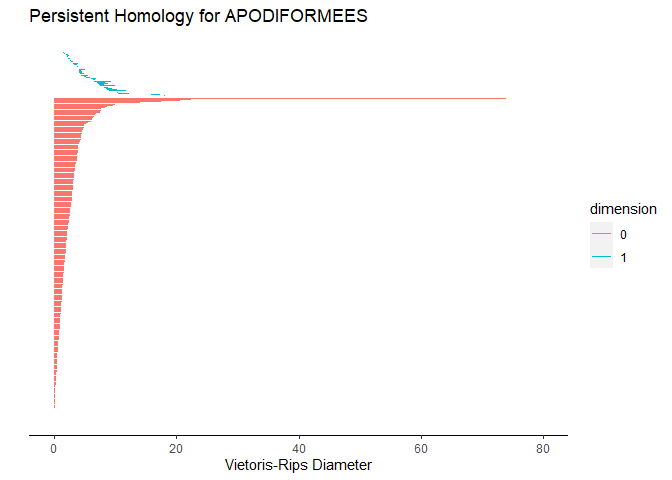
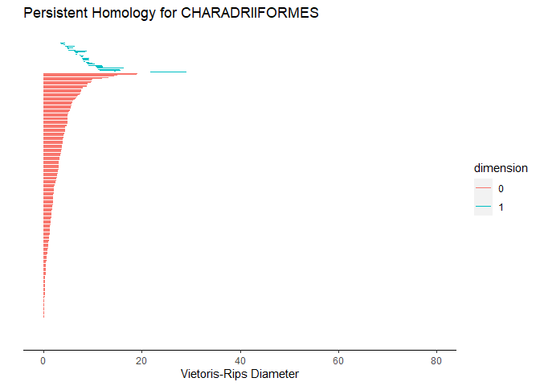

Comparing persistence diagramas of environmental niche centroids of
rodents and birds
================
Angel Robles
2022-05-04

## Introduction

Here we show a case of study where we calculate persisten homology for
environmental distance associated to the distribution of different
systems. First we start installing the require r package. We are going
to use mainly two package: the giotto-ph implementation (in python) that
allows to use parallel computation and the TDAstats thats allow us plot
and use statistical inference of the data.

``` r
if (!require("reticulate")) install.packages("reticulate")
#> Loading required package: reticulate
#> Warning: package 'reticulate' was built under R version 4.1.3
if (!require("tidyverse")) install.packages("tidyverse")
#> Loading required package: tidyverse
#> -- Attaching packages --------------------------------------- tidyverse 1.3.1 --
#> v ggplot2 3.3.5     v purrr   0.3.4
#> v tibble  3.1.6     v dplyr   1.0.8
#> v tidyr   1.2.0     v stringr 1.4.0
#> v readr   2.1.2     v forcats 0.5.1
#> Warning: package 'tibble' was built under R version 4.1.2
#> Warning: package 'tidyr' was built under R version 4.1.2
#> Warning: package 'readr' was built under R version 4.1.2
#> Warning: package 'dplyr' was built under R version 4.1.2
#> -- Conflicts ------------------------------------------ tidyverse_conflicts() --
#> x dplyr::filter() masks stats::filter()
#> x dplyr::lag()    masks stats::lag()


# # create a new environment 
virtualenv_create("TDA-environment")
#> virtualenv: TDA-environment

# # create a new environment and install from pip
virtualenv_install("TDA-environment", "giotto-ph")
#> Using virtual environment "TDA-environment" ...
virtualenv_install("TDA-environment", "numpy")
#> Using virtual environment "TDA-environment" ...
```

## Method

# Environmental centroids

We estimated the environmental distance among host species from their
ecological niche centroids based on information from the WorldClim
database (). To avoid multidimensionality we carried out a Principal
Component Analysis (PCA) of the 19 bioclimatic variables and generated
new layers from this analysis. We kept the first three PC layers
(approximately 85% of the total variance explained) and for each species
we cropped these layers using the IUCN shapefiles of their distribution
ranges () with the sf R package .

We used the kernel density estimation corresponding to the environmental
factor across the geographic distribution from the IUCN shapefiles,
taking a sample of raster cells within IUCN polygons from PCA
environmental layers. In order to understand each climatic variable as a
probability density function (PDF) associated with the host geographic
distribution , we calculate the environmental centroids from firest
three principal component variables.

An Euclidean matrix **E** of environmental distances of all host species
was generated. This procedure was performed independently for each
host-parasite system:

Where *e*<sub>*i**j*</sub> is the distance between *r*<sub>*i**j*</sub>,
the maxima of two *p*(**x**) distributions. 

This approach allowed more efficient computation without losing
information associated with each species, and it also allowed the
information to be compared between/among species. Because our objective
was to describe the environment for each species with the available
geographic data, we took the precaution of considering this multivariate
probability density function as a continuous function, which permits the
method to be applied to understanding the Hutchinsonian niche of the
species in order to compare bird species to each other .

# Persistent homology

Excluding the PASSERIFORMES, we keep the top orders of birds in number
of species. Then filter the distance matrix for each order and get one
distance matrix per order.

Follow this we calculate persistent homology. For each order

## Results

Briefly we show two patterns of persistence homology

``` r
p1 <- read_rds(file = "phAPODIFORMEES.rds" )
p2 <- read_rds(file = "phCHARADRIIFORMES.rds" )
p1
#> Warning: Removed 1 rows containing missing values (geom_segment).
p2
```


